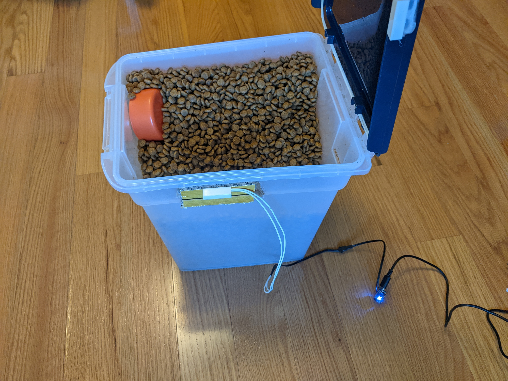
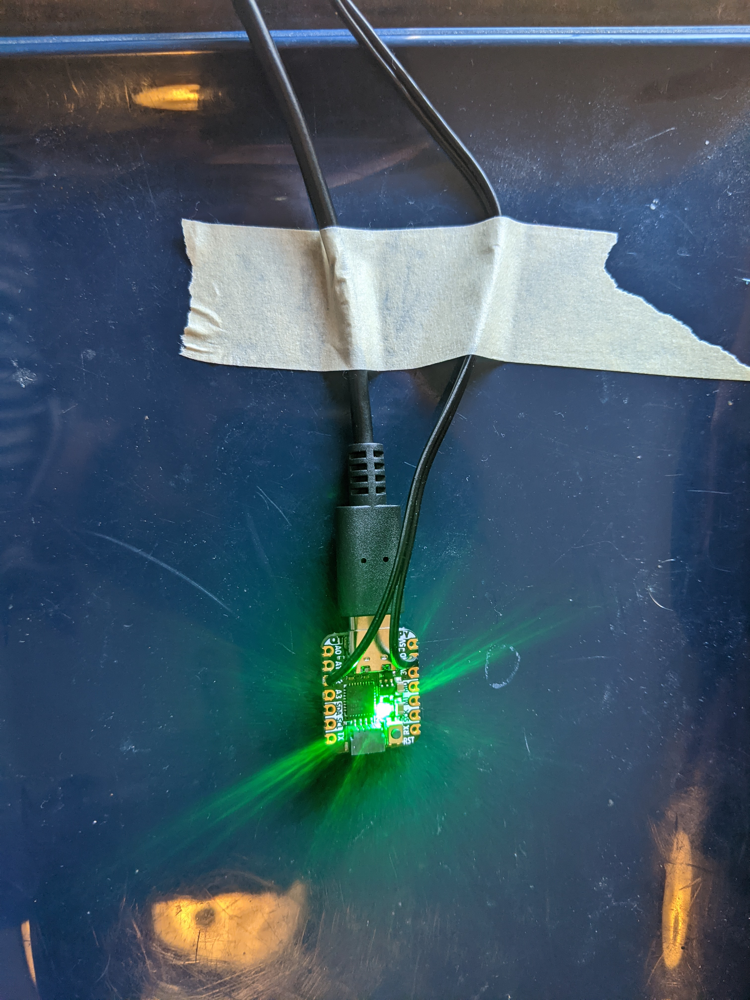
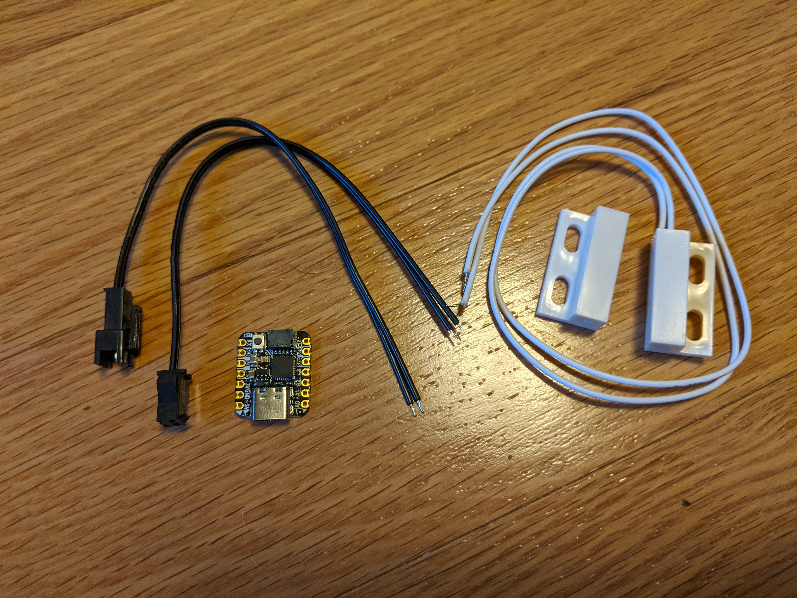

# dog-food
Answers the question of "Did anyone feed the dog yet?"

A sensor detects when the door to the dog food container is opened and turns the LED green if it has been opened within the last 8 hours, red if it hasn't. When the door is open, or it just booted up and doesn't know the last time the door opened, then the LED is blue.

 

Built with
* Adafruit QT Py - https://www.adafruit.com/product/4600
* Magnetic contact switch (door sensor) - https://www.adafruit.com/product/375
* 2-pin JST SM Plug + Receptacle Cable Set (optional) -https://www.adafruit.com/product/2880
* USB C Raspberry Pi Power Supply (any USB-C power supply will work here) - https://www.adafruit.com/product/4298
* Solder, cardboard, tape, hot-melt glue

 

Todo:
* Adding a light sensor to dim the LED when it's dark.
* Add a way to see exactly how long it's been and perhaps reset the time
* Mount and enclose things properly
